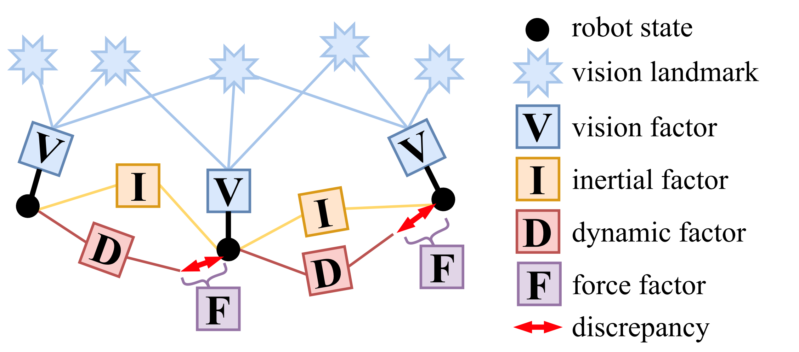

# VIMO
## Visual-Inertial Model-based State and External Forces Estimator



VIMO is a visual-inertial state and force estimator for multicopters. It incorporates robot's dynamic model in an optimization-based visual-inertial odometry system, such as [VINS-Mono](https://ieeexplore.ieee.org/document/8421746?arnumber=8421746&source=authoralert), to additionally provide external force estimates. Similar to IMU pre-integration, it preintegrates collective thrust generated by the propellors to form dynamic factors which, together with IMU factors, help distinguish between commanded motion and external disturbance.

**Videos:**

<!-- Add Blackbird dataset video with groundtruth, Snappy video with ground truth-->

If you use VIMO in an academic context, please cite the following paper:

**VIMO: Simultaneous Visual Inertial Model-based Odometry and Force Estimation**, Barza Nisar, Philipp Foehn, Davide Falanga, Davide Scaramuzza (RSS/IEEE-RAL, 2019), [pdf](http://rpg.ifi.uzh.ch/docs/RSS19_Nisar.pdf)

<!-- add bibtex entry -->

## 1. Prerequisites
1.1 **Ubuntu** and **ROS**
Ubuntu  16.04 or newer
ROS Kinetic or newer. [ROS Installation](http://wiki.ros.org/ROS/Installation)
additional ROS pacakge
```
    sudo apt-get install ros-YOUR_DISTRO-cv-bridge ros-YOUR_DISTRO-tf ros-YOUR_DISTRO-message-filters ros-YOUR_DISTRO-image-transport
```

1.2. **Ceres Solver**
Follow [Ceres Installation](http://ceres-solver.org/installation.html), remember to **make install**.
(Our testing environment: Ubuntu 18.04.3, ROS Melodic, OpenCV 3.4.9, Eigen 3.3.4) 

## 2. Build VIMO on ROS
Clone the repository and catkin_make:
```
    cd ~/catkin_ws/src
    git clone https://github.com/uzh-rpg/vimo.git
    cd ../
    catkin_make
    source ~/catkin_ws/devel/setup.bash
```

**Note: Current VIMO version fails if control commands are zero.** Therefore, it is recommended to run it offline on datasets and ros bags. 

## 3. VIMO on Public datasets
We can only run VIMO on datasets that contain motor speeds or control commands. One such dataset is [Blackbird Dataset](https://github.com/mit-fast/Blackbird-Dataset). We tested VIMO on Blackbird's **star** and **picasso** sequences. Settings to run VIMO on Blackbird dataset are in **blackbird** branch.

```
    cd ~/catkin_ws/src/vimo
    git checkout blackbird
    cd ../..
    catkin_make
```

Open three terminals, launch the vimo_estimator, rviz and play the bag file respectively. Take star_maxSpeed1p0 for example
```
    roslaunch vimo_estimator vimo.launch 
    roslaunch vimo_estimator vins_rviz.launch
    rosbag play YOUR_PATH_TO_DATASET/star_maxSpeed1p0.bag YOUR_PATH_TO_DATASET/star_maxSpeed1p0_images.bag 
```

<!-- (Optional) Visualize ground truth. A naive benchmark publisher from [VINS-Mono](https://github.com/HKUST-Aerial-Robotics/VINS-Mono) can help you visualize the ground truth. It uses a naive strategy to align VIMO with ground truth. Just for visualization. not for quantitative comparison on academic publications.
```
    roslaunch benchmark_publisher publish.launch  sequence_name:=star
```
 (Green line is VIMO result, red line is ground truth). -->

## 4. Force estimation with VIMO

<!-- Add link to snappy and helical 8 bag and its force estimation result -->

## 5. Acknowledgements
We use [VINS-Mono](https://github.com/HKUST-Aerial-Robotics/VINS-Mono) for visual-inertial odometry, [ceres solver](http://ceres-solver.org/) for non-linear optimization and [DBoW2](https://github.com/dorian3d/DBoW2) for loop detection, and a generic [camera model](https://github.com/hengli/camodocal).

## 6. License
The source code is released under [GPLv3](http://www.gnu.org/licenses/) license.

We are still working on improving the code reliability. For any technical issues, please contact Barza Nisar <barza@ifi.uzh.ch> or Philipp Foehn <foehn@ifi.uzh.ch>

For commercial inquiries, please contact Davide Scaramuzza <scarabotics@gmail.com>